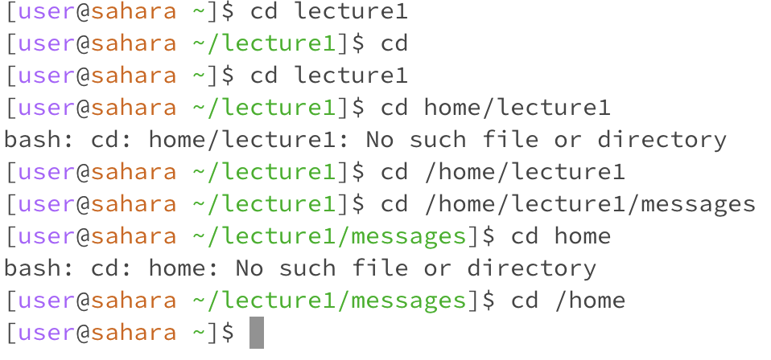

# Sohaib Khan's Lab 1 Report

## cd (Change Directory)
1. When cd is ran in the root directory with no arguments. Nothing changes, we stay in the same directory and no error is occurred. When cd with no arguments is ran in another directory, it always goes back to the root directory, no matter where you do it from. The pictures below display this: In our first picture, we did cd with no arguments in two directories. The highlighted in yellow represents us doing cd in the lecture1 directory, which is actually in the root directory. After we cd, we get back to the root directory represented by just a ~. When we do cd in the root directory itself (highlighted in blue), nothing happens. We stay in the same directory and no errors occur. In the second picture we are in the directory, messages, which is lecture 1, thus two directories ahead of the root. When we cd from there, it also goes back to the root directory, again represented by the ~, the “tilda”.

    

    

2. When you cd with a path to a directory, it goes to that directory, but only if it is inside your current directory (unless you put/?). For example. If I am in the root folder and I try to directly get into messages, it will not work as the only directory that cd sees in the root folder is lecture 1, as shown in the 2nd image, highlighted in yellow. We end up getting a “No such file or directory” error. But, if I put cd lecture1/messages rather than just cd messages, it will go into messages (highlighted in yellow in the first image). Furthermore, you cannot go backwards with cd as well. Let’s say I go cd lecture1/messages, then I try to do cd lecture1, it will give me a no such file or directory error (highlighted in blue). If you want to go backwards, you can do “cd ..” or if you want to go back to root, you can simply do cd with no arguments. In the first picture, for the yellow part, we are currently in the root directory, we then cd into messages via cd lecture1/messages and thus we are able to get into messages. Now, while we are in the messages directory, if we try to do cd lecture1, we get an error saying no such file or directory. In the second picture, we are back in the root directory, and we try to cd directly into messages, it will not work as it doesn’t see messages in its own directory, thus it will give us an error, “No such file or directory”. In the third picture, we are in the root folder and simply cd lecture1. Voila, we are in the lecture 1. Now, if you are in any directory, you can access any other directory, if you put the absolute for that directory, so it must start witha "/". Such is shown in the 4th picture.

	Now, in any directory if you put “/“ before…..it can go correct?

    

     

      

     
   
    

4. When you put the path to a file, you get a "Not directory error." Frin this we can conlude that cd is only used to go in or out of directories.

   

## ls (List)
1. When you do ls with no arguments, it shows the contents of the directory you are currently in.

   

2.  When you ls a directory, it displays all the files and directories in the specified directory. *Files are in normal font, directories are bold and blue.*

    

3.  When you ls a file, it just displays the file path of that file from the current directory.

    

## cat (Concatenate)
1. When you cat with no arguments, it goes into the next line where you type in anything, and whatever you type in, it displays that again. Basically a textbox. (Highlighted in Blue)
2. When you cat into a directory, cat displays the specified directory and states it's a directory. (Higlighted in Yellow)
3. When you cat into a file, cat displays the content in that specified file. (Highlighted in Red)

