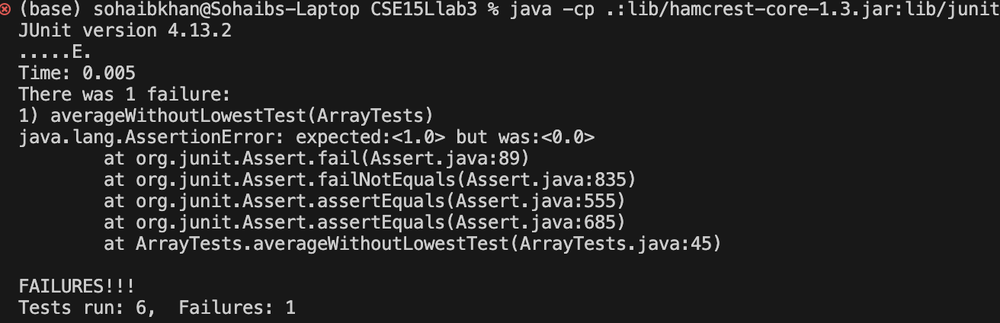

# Lab Report 1
## Part 1
The original code is in the class, ArrayExamples, the method we are looking at it averageWithoutLowest.
The aim of this method is to take the mean of all the values in the array except the lowest value. But what if there are duplicate lowest values? Then we aim to remove only one of them, or an array of all the same values.
Here is the original code:

    static double averageWithoutLowest(double[] arr) {
      if(arr.length < 2) { return 0.0; }
      double lowest = arr[0];
      for(double num: arr) {
        if(num < lowest) { lowest = num; }
      }
      double sum = 0;
      for(double num: arr) {
        if(num != lowest) { sum += num; }
      }
      return sum / (arr.length - 1);
    }

1. Failure inducing input
  With the original code, the failure inducing test I ran was:
  
        @Test
        public void averageWithoutLowestTest(){
          double[] input = {1, 1, 1, 1, 1}; //try with all ones
      
          //int output = 1;
      
          assertEquals(1, ArrayExamples.averageWithoutLowest(input),0);
        }

input, {1,1,1,1,1} is our failure inducing input. 

2.  Test case that passed
A test that passed was when I made the input {1,2,3,4,5} which got our output at 3.5 which was as expected.
Here is the code for that test:

        @Test
          public void averageWithoutLowestnodups(){
            double[] input = {1, 2, 3, 4, 5}; //actual values to check it works properly in this case
        
            assertEquals(3.5, ArrayExamples.averageWithoutLowest(input), 0); //this works as expected
          }

3. The symptom lies in our averageWithoutLowest method where we start off fine by the first for loop, setting our lowest value. The issue occurs, when we try to add up all the values that are not the lowest value. That for loop adds up all values not equal to the lowest value. Thus, in an array with duplicates, such as {1,1,1,1,1}, we would expect it to not count one 1, but all of them are not counted, thus our sum is 0 and our output is 0, when it should be 1.

4. The Bug

In the above picture, we can see that all of our tests passed except for the test, "averageWithoutLowest" which shows we expected 1.0, but instead we got 0.0. 
This also shows, that if there are not any duplicates, such as {1,2,3,4,5}, the method works as expected as we did not get a failure.

5. The Fix

          static double averageWithoutLowest(double[] arr) {
          if(arr.length < 2) { return 0.0; }
          double lowest = arr[0];
          for(double num: arr) {
            if(num < lowest) { lowest = num; }
          }
          
          int indexToRemove = -1;
      
          for (int i = 0; i < arr.length; i++){
            if (arr[i] == lowest){
              indexToRemove = i;
              break;
            }
          }
      
          double[] new_arr = new double[arr.length-1];
          for (int i = 0; i < arr.length; i++){
            if (i == indexToRemove)
              continue;
            new_arr[i - 1] = arr[i];
          }
      
      
          double sum = 0;
          for(double num: new_arr) {
            sum += num; 
          }
      
      
          return sum / new_arr.length; //arr.length - 1 or new_arr.length, either way works
        }

The fix I made was that I took the value of the index of the element I would like to remove (indexToRemove = i), then I make another for loop, copying the array to a new array, except for when
i = indexToRemove, then I continue. After that, I sum all the values in that new_array, and divide by arr.length-1, or new_arr.length whose length I initialized to be 1 less than the original.

## Part 2

The command I tinkered with was grep. The four commands I found interested from grep were:
1. -i or --ignore-case: Perform a case insensitive search.
2. -l or --files-with-matches: Display only the names of files containing matching lines
3. -v or --invert-match: Showing the lines that don't match the given pattern 
4. -c or --count: Display the count of matching lines instead of the lines themselves

I got these commands from ChatGPT via this link: https://chat.openai.com/share/9f70ff78-b19a-4629-88fd-b615e89e7e3a
I asked it for some command line options for grep, and it gave me a list of twelve. I decided to work with the four above.
Note: This is only for files, if you try doing it on a directory it will throw an error, such as: "grep: technical/government/Alcohol_Problems/: Is a directory".
after I tried to do "grep  'america'  technical/government/Alcohol_Problems/".

### Ignore Case
This command ignores case sensitivity. 
This is the command I typed in below. I am looking for America in the Alcohol_Problems folder. I put -i, and just put "america" and I was able to get a plethora of results with "America"
in them. Right below, I tried doing it again without the -i, and I got no results!
#### First Example:

    (base) sohaibkhan@Sohaibs-Laptop docsearch % grep -i "america"  technical/government/Alcohol_Problems/*.txt
    
    technical/government/Alcohol_Problems/Session2-PDF.txt:problematic consumption of alcohol. The American Psychiatric
    technical/government/Alcohol_Problems/Session2-PDF.txt:West Virginia Chapter of the American College of Emergency
    technical/government/Alcohol_Problems/Session2-PDF.txt:2. American Psychiatric Association. Diagnostic and Statistical
    technical/government/Alcohol_Problems/Session2-PDF.txt:Manual of Mental Disorders. Washington (DC): American Psychiatric
    technical/government/Alcohol_Problems/Session2-PDF.txt:American Psychiatric Press; 1990.
    technical/government/Alcohol_Problems/Session3-PDF.txt:Committee on Trauma of the American College of Surgeons indicating
    technical/government/Alcohol_Problems/Session3-PDF.txt:12. Soderstrom CA, Cole FJ, Porter JM. Injury in America: the
    technical/government/Alcohol_Problems/Session3-PDF.txt:studies in American emergency settings have provided
    technical/government/Alcohol_Problems/Session4-PDF.txt:most recent version of the American College of Surgeons monograph
    technical/government/Alcohol_Problems/Session4-PDF.txt:4. Committee on Trauma, American College of Surgeons. Optimal
    technical/government/Alcohol_Problems/Session4-PDF.txt:Care of the Injured Patient: 1999. Chicago (IL): American College
    technical/government/Alcohol_Problems/Session4-PDF.txt:example, he noted that the American College of Surgeons' Resources
    technical/government/Alcohol_Problems/Session4-PDF.txt:that the group that wrote the latest version of the American
    
    (base) sohaibkhan@Sohaibs-Laptop docsearch % grep  "america"  technical/government/Alcohol_Problems/*.txt 
    (base) sohaibkhan@Sohaibs-Laptop docsearch % 

#### Second Example:
For my second example, I tried looking for finches in the biomed folder. 
I tried "Finch" initially with no -i, and it was not able to find anything. But once I put in the ignore case sensitive command, I was able to get a couple results in the biomed directory!

    (base) sohaibkhan@Sohaibs-Laptop docsearch % grep "Finch" technical/biomed/*.txt    
    
    (base) sohaibkhan@Sohaibs-Laptop docsearch % grep -i "Finch" technical/biomed/*.txt
    
    technical/biomed/1471-2105-3-2.txt:        Galapagos finches led to an appreciation of the structural
    technical/biomed/1471-2105-3-2.txt:        the finches' structural features was the foundation for his

#### Use Case
I think this is a very useful command as if you save many files on your device for example, and you don't know which file you put information about a specific topic, it could become
very tediuous looking for that document or file. You don't remember whether it was capitol or not, and you may think you don't have that document in a specific directory because 
of the case sensitivity of the command line. But in fact, if you had simply used "-i", you would have found it!

### Files With Matches
This command displays only the names of files containing matching lines

#### First Example
In this first example, I tried looking for the line "Many patients in the emergency department (ED) have alcohol                                              ".
All the documents in the Alocohol_Problems Directory had that line.

    (base) sohaibkhan@Sohaibs-Laptop docsearch % grep -l "Many patients in the emergency department (ED) have alcohol" technical/government/Alcohol_Problems/*txt
    technical/government/Alcohol_Problems/Session2-PDF.txt

#### Second Example
In this second example, I looked for the line "Mancy Mintie's Uncommon Good organization pays" in the Media folder! Only one document had this line!
    
    (base) sohaibkhan@Sohaibs-Laptop docsearch % grep -l "Mancy Mintie's Uncommon Good organization pays" technical/government/Media/*.txt 
    technical/government/Media/A_helping_hand.txt

#### Use Case
I think this command is very useful if you are looking a specfic line out of all the thousands of documents you may have in a folder or directory. For example, the Media directory has roughly 140 files. Imagine try to look for the line "Mancy Mintie's Uncommon Good organization pays" in one of those files. Very time consuming. Rather you could use this command and be done in no time.

### Invert Match
This command shows us the lines that don't match the given pattern. 

#### First Example
I tried looking for "Mancy Mintie's Uncommon Good organization pays" in the Alcohol_Problems directory and had many many lines spit out at me, these just a few of them below.

    grep -v "Mancy Mintie's Uncommon Good organization pays" technical/government/Alcohol_Problems/    
    Boston Medical Center as a value-added service in the emergency
    department. Patients without insurance may also be referred to
    community resources and self-help groups. Those with insurance have
    at least some access to treatment services to which they can be
    referred.
    Emergency department physicians may obtain the training
    necessary to perform the intervention, but in most hospitals,
    staffing constraints will prevent them from being the primary
    providers of this service.44 Furthermore, instilling this knowledge

#### Second Example
Command I ran:

    (base) sohaibkhan@Sohaibs-Laptop docsearch % grep -v "Hello" technical/government/Alcohol_Problems/*txt

    technical/government/Alcohol_Problems/Session4-PDF.txt:Robert Woolard favored continuing intervention research in EDs.
    technical/government/Alcohol_Problems/Session4-PDF.txt:He believed that the realities of our practice settings help drive
    technical/government/Alcohol_Problems/Session4-PDF.txt:the development of new ways of delivering counseling, for example,
    technical/government/Alcohol_Problems/Session4-PDF.txt:computer-based methods. While emergency physicians may not have the
    technical/government/Alcohol_Problems/Session4-PDF.txt:time or interest, the patients do. He suggested that research in
    technical/government/Alcohol_Problems/Session4-PDF.txt:trauma centers and EDs can help alcohol researchers learn more
    technical/government/Alcohol_Problems/Session4-PDF.txt:about the interventions they have already developed and can even
    technical/government/Alcohol_Problems/Session4-PDF.txt:lead to novel interventions.

This time I ran on all files in the Alcohol_Problems directory. Again, I was greeted with many lines, and above are a few of them.

#### Use Case
I would say this command line could be very useful when it comes to copying something from one document to another document, except for one line. 
E.g. "grep -v 'hello' technical/government/Alcohol_Problems/Session4-PDF.txt > no_hello.txt. This will put all the lines that are in Session4-PDF.txt in the document no_hello.txt except for the lines that have "hello" in it.

### Count
Display the count of matching lines instead of the lines themselves.

#### First Example
I tried to see how many lines have "Hello" in the biomed directory.
It printed out the file path from the directory I was looking from for all the files with a number next to them. This number represents which lines have "Hello" in them.

    (base) sohaibkhan@Sohaibs-Laptop docsearch % grep -c "Hello" technical/biomed/*txt                                 
    technical/biomed/1468-6708-3-1.txt:0
    technical/biomed/1468-6708-3-10.txt:0
    technical/biomed/1468-6708-3-3.txt:0
    technical/biomed/1468-6708-3-4.txt:0

There were many more lines but then that would make this lab report very lengthy.

#### Second Example
I tried to see how many lines have "alcohol" in the Alcohol_Problems Directory

    (base) sohaibkhan@Sohaibs-Laptop docsearch % grep -c "alcohol" technical/government/Alcohol_Problems/*txt
    technical/government/Alcohol_Problems/DraftRecom-PDF.txt:53
    technical/government/Alcohol_Problems/Session2-PDF.txt:97
    technical/government/Alcohol_Problems/Session3-PDF.txt:168
    technical/government/Alcohol_Problems/Session4-PDF.txt:164

As we can see above, the count for the word "alcohol" varies in each of these files!
        

#### Use Case
This could be useful for filtering out all the files that have the lines you are looking for. 

   

