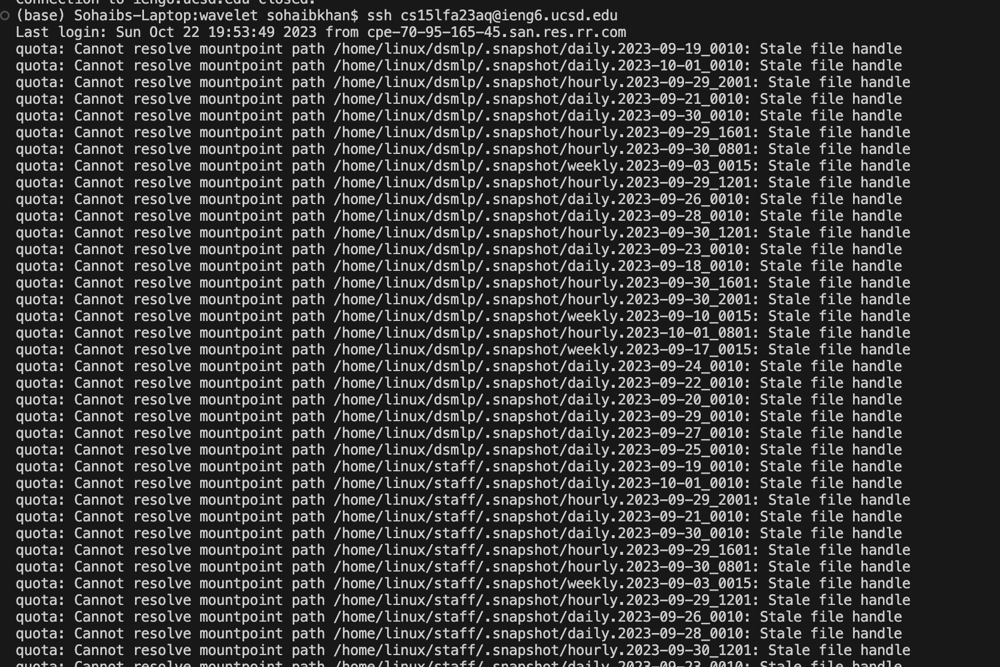

# Sohaib Khan's Lab Report 2

## Part 1

### Code for StringServer.java

import java.io.IOException;
import java.net.URI;

    class Handler implements URLHandler {
        // The one bit of state on the server: a string that will be manipulated by
        // various requests.
        //int num = 0;
        String string = ""; //No Current strings
        int num = 0;
    
        public String handleRequest(URI url) {
            if (url.getPath().equals("/")) {
                return String.format("%s", string);
            }
            //   else if (url.getPath().equals("/increment")) {
            //     num += 1;
            //     return String.format("Number incremented!");
            // } 
            else if (url.getPath().equals("/clear")){
                num = 0;
                return string = "";
            }
            else {
                if (url.getPath().contains("/add-message")) {
                    String[] parameters = url.getQuery().split("=");
                    if (parameters[0].equals("s")) {
                        num++;
                        return string += String.format("%d. %s\n", num, parameters[1]);//num += Integer.parseInt(parameters[1]);
                        //return "String added!";
                        //return String.format("increased by %s! It's now %d", parameters[1], num);
                    }
                }
                return "404 Not Found!";
            }
        }
    }

    class StringServer {
        public static void main(String[] args) throws IOException {
            if(args.length == 0){
                System.out.println("Missing port number! Try any number between 1024 to 49151");
                return;
            }
    
            int port = Integer.parseInt(args[0]);
    
            Server.start(port, new Handler());
        }
        
    }

1. In the first screen shot, the method that is being called is handleRequest.
2. The argument that it takes is a url, i.e. the url for the server that we have created. The fields in this class are String string, and int num. String is set to an empty string, and num is set to 0. 
3. In this method, if I add the path/query /add-messages?s=“insert something here”. Then whatever I typed in is added on to the string and the num variable is incremented by 1. 

1. In the second screen shot, the method that is being called is handleRequest.
2. The argument that it takes is a url, i.e. the url for the server that we have created. The fields in this class are String string, and int num. String is set to an empty string, and num is set to 0. We have already called to this method once, so the num is currently set to 1, and string is currently set to "Hello"
3. In this method, if I add the path/query /add-messages?s=“insert something here”. Then whatever I typed in is added on to the string in the next line and the num variable is incremented by 1 to equal 2. 

## Part 2

### Path to private key with private key displayed and ls

### Path to public key with public key displayed and ls in ieng account

### Login to ieng with no password

## Part 3

### Week 2 Lab
In Week 2, I learned how to log into my remote machine account in SSH through edstem. I also learned how to build my own website/server and how to mess around with the commands and servers!

### Week 3 Lab
In Week 3, I learned how to do those same skills I did in week 2 on VScode rather than edstem. I also learned how I can login into my account without a password from my home computer!

