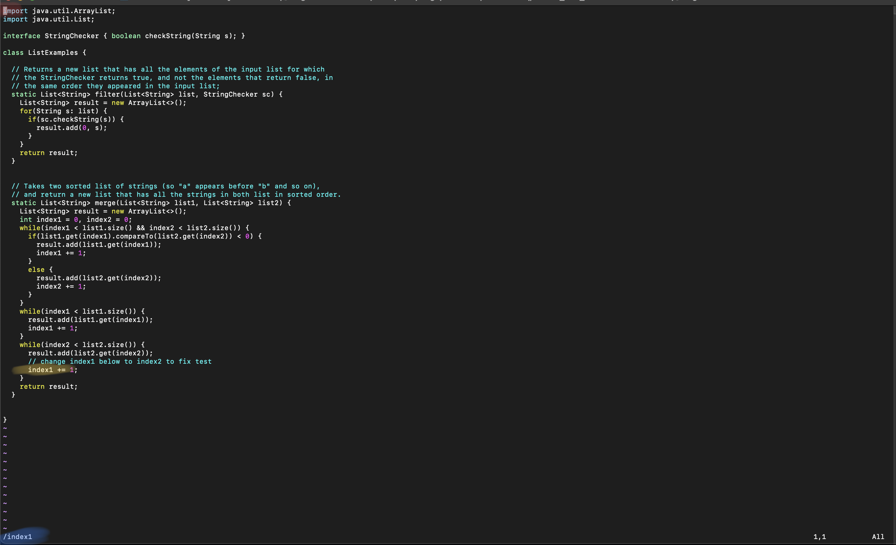

# Lab Report 4

## Skip Step 1-3

## Step 4: Log into ieng6
1. Type ssh along with your associated account, cs15lfa23zz@ieng6.ucsd.edu
2. Then Press Enter
3. Type in password if needed (and press enter again if applicable)

## Step 5: Clone your fork of the repository from your Github account (using the SSH URL)

We want to use the SSH link as highlighted in the image above because we will not be able to push our changes to our repository if we use the standard HTTPS link.

1. Type git clone "insert repo SSH link here"
2. Press Enter
3. Then cd into whatever the directory name is, here it is "cse15L_lab7_fork"

In the image above highlighted in yellow, we git cloned using our SSH link, and then after our clone, we cd into the "cse15L_lab_fork" directory from the home directory.

## Step 6: Run the tests, demonstrating that they fail

1. If not already in cse15L_lab7_fork directory, cd into cse15L_lab_fork.
2. Type in bash test.sh
3. There should be a failure as we see in the image below

## Step 7: Edit the code file to fix the failing test

1. Type in vim ListExamples.java 
2. We are currently at the left most of the first line on the "i" of "import java.util.ArrayList; (highlighted in red in image of next step.
3. We want to change index1 to index2 at line 44 (highlighted in yellow in image to right) 
4. Then, what we do is we "/index1" as we can see at the bottom left of the image above highlighted in blue.
5. Then press enter, now we are at the first occurrence of index1. Press "n" to go to the next occurence.
6. We do this until we reach our desired "index1" which is 9 times in this file, i.e. we press "n" 9 times. (highlighted in image to the right) 
7. Now that we are at our desired index1, we press "c" + "w" which will delete the word and take us into insert mode. (as shown in the image, deleted part yellow, and Insert in blue) 
8. Now type in "index2" (as shown in the image highlighted in yellow)
9. Press Escape to turn into normal mode
10. Type ":wq" to save and exit.
11. Changes should now be saved

## Step 8: Run the tests demonstrating they they now succeed

1. Now that you are back in the bash, type "bash test.sh" again or press the up button a couple times to use the same "bash test.sh" command you used earlier.
2. Your tests should now pass with no issues! (as shown in image on the right) 

## Step 9: Commit and push the resulting change to your Github account

1. type "git add ListExamples.Java" (Highlighted in yellow in the image at step 4)
2. Check to see if the file is ready to be committed via "git status" (highlighted in blue in the image at step 4)
3. Now that it's added to the stage, type "git commit -m "Whatever message you want". I put "index1 to index2 edit for Lab Report 4" (highlighted in red in the image at step 4)
4. Now type "git push" (highlighted in purple to the image on the right) 
5. Now you have successfully made changes to the file, ListExamples.java and we have successfully pushed them to the main branch of the repository.

