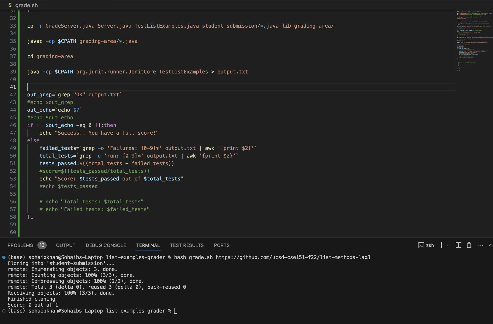
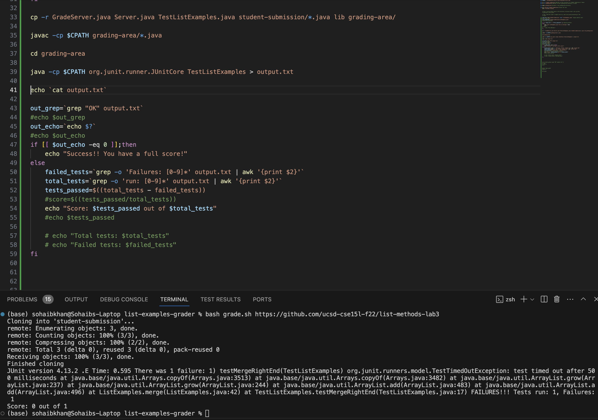
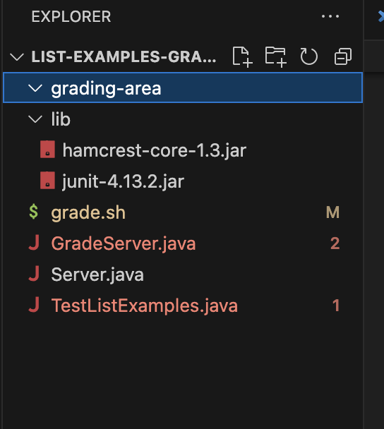

# Lab Report 5

## Part 1: Debugging Scenario

### Original Post

Hi, I can't really get a sense of why my test is failing when I clone my github repository for grading via grade.sh. I am sure it has something to do with my bash script as I am very sure about my ListExamples.java implementation being correct! I was thinking the failure inducing bug has something to do with my classpath and java commands from line 33-39. 

### TA's Response

Hi, your grade.sh script appears fine to me, is it probably in your ListExamples.java implementation. From this current script we can't see what that issue is, but, I noticed you put the output of your JUnit tests in "output.txt" at line 39. Try using the cat command to see what's in that file. That could provide us a better idea of what's going on.

### Student Trying TA's Advice

I did: 
    
     echo `cat output.txt`
 
 after the line:
     
     java -cp $CPATH org.junit.runner.JUnitCore TestListExamples > output.txt

From my terminal output, it appears my ListExamples.java was the issue, I can see that the JUnit timed out! This must mean in ListExamples.java I have an infinite loop somewhere.

### Information About The Setup
#### 1. File and Directory Structure Needed
The file/directory structure we need is:
list-examples-grader
 -grading-area
 -grade.sh
 -GraderServer.java
 -Server.java
 -TestListExamples.java
 -lib
   -hamcrest-core-1.3.jar
   -junit-4.13.2.jar

#### 2. Contents of Each File Before Fixing The Bug

grade.sh content before fixing the bug:

    CPATH='.:lib/hamcrest-core-1.3.jar:lib/junit-4.13.2.jar' 
    
    rm -rf student-submission #deletes current directory of student submission if there
    rm -rf grading-area #deletes current grading-area directory if there
    
    mkdir grading-area #creates a new grading-area directory
    
    git clone $1 student-submission #clones the link 
    echo 'Finished cloning'
    
    
    # Draw a picture/take notes on the directory structure that's set up after
    # getting to this point
    
    # Then, add here code to compile and run, and do any post-processing of the
    # tests
    
    lab_file=`find student-submission -name "ListExamples.java"` #space matters here
    #echo $lab_file
    file_expected="student-submission/ListExamples.java"
    #echo $file_expected
    
    if [[ "$lab_file" != "$file_expected" ]]; 
    then 
        echo "The ListExamples.java file is missing!" 1>&2
        exit 1
    fi
    
    cp -r GradeServer.java Server.java TestListExamples.java student-submission/*.java lib grading-area/
    
    javac -cp $CPATH grading-area/*.java
    
    cd grading-area
    
    java -cp $CPATH org.junit.runner.JUnitCore TestListExamples > output.txt
    
    
    out_grep=`grep "OK" output.txt`
    
    out_echo=`echo $?`
    
    if [[ $out_echo -eq 0 ]];then 
        echo "Success!! You have a full score!"
    else 
        failed_tests=`grep -o 'Failures: [0-9]*' output.txt | awk '{print $2}'`
        total_tests=`grep -o 'run: [0-9]*' output.txt | awk '{print $2}'`
        tests_passed=$((total_tests - failed_tests))
        #score=$((tests_passed/total_tests))
        echo "Score: $tests_passed out of $total_tests"
    fi

ListExamples.java content before fixing the bug:

    import java.util.ArrayList;
    import java.util.List;
    
    interface StringChecker { boolean checkString(String s); }
    
    class ListExamples {
    
      // Returns a new list that has all the elements of the input list for which
      // the StringChecker returns true, and not the elements that return false, in
      // the same order they appeared in the input list;
      static List<String> filter(List<String> list, StringChecker sc) {
        List<String> result = new ArrayList<>();
        for(String s: list) {
          if(sc.checkString(s)) {
            result.add(0, s);
          }
        }
        return result;
      }
    
    
      // Takes two sorted list of strings (so "a" appears before "b" and so on),
      // and return a new list that has all the strings in both list in sorted order.
      static List<String> merge(List<String> list1, List<String> list2) {
        List<String> result = new ArrayList<>();
        int index1 = 0, index2 = 0;
        while(index1 < list1.size() && index2 < list2.size()) {
          if(list1.get(index1).compareTo(list2.get(index2)) < 0) {
            result.add(list1.get(index1));
            index1 += 1;
          }
          else {
            result.add(list2.get(index2));
            index2 += 1;
          }
        }
        while(index1 < list1.size()) {
          result.add(list1.get(index1));
          index1 += 1;
        }
        while(index2 < list2.size()) {
          result.add(list2.get(index2));
          index1 += 1;
        }
        return result;
      }
    
    
    }

#### 3. Full Command Lines of of what I ran to trigger the bug

    cp -r GradeServer.java Server.java TestListExamples.java student-submission/*.java lib grading-area/
    javac -cp '.:lib/hamcrest-core-1.3.jar:lib/junit-4.13.2.jar' grading-area/*.java
    cd grading-area
    java -cp '.:lib/hamcrest-core-1.3.jar:lib/junit-4.13.2.jar' org.junit.runner.JUnitCore TestListExamples

JUnit File I ran:

    import static org.junit.Assert.*;
    import org.junit.*;
    import java.util.Arrays;
    import java.util.List;
    
    class IsMoon implements StringChecker {
      public boolean checkString(String s) {
        return s.equalsIgnoreCase("moon");
      }
    }
    
    public class TestListExamples {
      @Test(timeout = 500)
      public void testMergeRightEnd() {
        List<String> left = Arrays.asList("a", "b", "c");
        List<String> right = Arrays.asList("a", "d");
        List<String> merged = ListExamples.merge(left, right); //This line is where the bug was triggerred
        List<String> expected = Arrays.asList("a", "a", "b", "c", "d");
        assertEquals(expected, merged);
      }
    }

In the grade.sh file to read output.txt, I typed:

    echo `cat output.txt`

#### 4. A description of what to edit to fix the bug

In this code block given here in the merge method of ListExamples.java:

        while(index2 < list2.size()) {
          result.add(list2.get(index2));
          index1 += 1;
        }

I changed index1 to index2 to fix the issue, because index2 wasn't being incremented we were stuck in an infinite loop:
      
      while(index2 < list2.size()) {
          result.add(list2.get(index2));
          index2 += 1;
        }
    

 

## Part 2: Reflection

There were many great things I learned from this class which I can go on about, the command line arguments, bash scripts, Vim, etc. But the main thing that I took advantage of and implemented immediately was JDB. JDB is a phenomenal tool; I have already started using it with my CSE12 PAs and it has been extremely advantageuous when it comes to debugging my code. Knowing about this in CSE11 would have been helpful as this is a huge time saver as opposed to inserting random print statements in my code.

