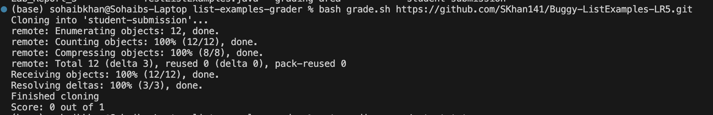

# Lab Report 5

## Part 1: Debugging Scenario

### Original Post

Hi, I can't really get a sense of why my test is failing when I clone my github repository for grading via grade.sh. I am sure my grade.sh file works fine, thus I think it has something to do with my ListExamples.java not sorting properly when the two lists are merged, would this be correct?



grade.sh script:
```
CPATH='.:lib/hamcrest-core-1.3.jar:lib/junit-4.13.2.jar' 

rm -rf student-submission #deletes current directory of student submission if there
rm -rf grading-area #deletes current grading-area directory if there

mkdir grading-area #creates a new grading-area directory

git clone $1 student-submission #clones the link 
echo 'Finished cloning'


# Draw a picture/take notes on the directory structure that's set up after
# getting to this point

# Then, add here code to compile and run, and do any post-processing of the
# tests

lab_file=`find student-submission -name "ListExamples.java"` #space matters here
#echo $lab_file
file_expected="student-submission/ListExamples.java"
#echo $file_expected

if [[ "$lab_file" != "$file_expected" ]]; #spacing matters
then 
    echo "The ListExamples.java file is missing!" 1>&2
    exit 1
fi

cp -r GradeServer.java Server.java TestListExamples.java student-submission/*.java lib grading-area/

javac -cp $CPATH grading-area/*.java

cd grading-area

java -cp $CPATH org.junit.runner.JUnitCore TestListExamples > output.txt

#echo `cat output.txt`


out_grep=`grep "OK" output.txt`

out_echo=`echo $?`

if [[ $out_echo -eq 0 ]];then 
    echo "Success!! You have a full score!"
else 
    failed_tests=`grep -o 'Failures: [0-9]*' output.txt | awk '{print $2}'`
    total_tests=`grep -o 'run: [0-9]*' output.txt | awk '{print $2}'`
    tests_passed=$((total_tests - failed_tests))
    #score=$((tests_passed/total_tests))
    echo "Score: $tests_passed out of $total_tests"
fi
```

My Code for ListExamples.java:

```
import java.util.ArrayList;
import java.util.List;

interface StringChecker { boolean checkString(String s); }

class ListExamples {

  // Returns a new list that has all the elements of the input list for which
  // the StringChecker returns true, and not the elements that return false, in
  // the same order they appeared in the input list;
  static List<String> filter(List<String> list, StringChecker sc) {
    List<String> result = new ArrayList<>();
    for(String s: list) {
      if(sc.checkString(s)) {
        result.add(0, s);
      }
    }
    return result;
  }


  // Takes two sorted list of strings (so "a" appears before "b" and so on),
  // and return a new list that has all the strings in both list in sorted order.
  static List<String> merge(List<String> list1, List<String> list2) {
    List<String> result = new ArrayList<>();
    int index1 = 0, index2 = 0;

  
    while(index1 < list1.size() && index2 < list2.size()) {

      result.add(list2.get(index2));
        index2 += 1;
    }
    while(index1 < list1.size()) {
        result.add(list1.get(index1));
        index1 += 1;
    }
    while(index2 < list2.size()) {
        result.add(list2.get(index2));
        index2 += 1;
    }
    return result;
  }


}
```


### TA's Response

Hi, your grade.sh script appears fine to me, it is probably in your ListExamples.java implementation. From this current script we can't see what that issue is, but, I noticed in your grade.sh, you stored the output of your JUnit tests in "output.txt" at line 39. Try using the cat command to see what's in that file. That could provide us a better idea of what's going on.

### Student Trying TA's Advice


I did: 
    
     cat grading-area/output.txt

in the terminal

From my terminal output, it appears that I was correct about my ListsExample.java not sorting the lists properly, how would I fix this?
```
JUnit version 4.13.2
.E
Time: 0.006
There was 1 failure:
1) testMergeRightEnd(TestListExamples)
java.lang.AssertionError: expected:<[a, a, b, c, d]> but was:<[a, d, a, b, c]>
        at org.junit.Assert.fail(Assert.java:89)
        at org.junit.Assert.failNotEquals(Assert.java:835)
        at org.junit.Assert.assertEquals(Assert.java:120)
        at org.junit.Assert.assertEquals(Assert.java:146)
        at TestListExamples.testMergeRightEnd(TestListExamples.java:19)

FAILURES!!!
Tests run: 1,  Failures: 1
```


### TA's Response
Looking at your ListExamples.java code, I noticed that in your first while loop you never compare the values of each list before adding the elements to your merged list. Try doing that!

### Student's Fixed Bug Response
I fixed the bug! The issue was as you had said, I didn't compare the values of each list:

Before:
```
while(index1 < list1.size() && index2 < list2.size()) {
    //I was just adding list2 to result without any comparison
    result.add(list2.get(index2));
    index2 += 1;
}
```

After:
```
 while(index1 < list1.size() && index2 < list2.size()) {
        if(list1.get(index1).compareTo(list2.get(index2)) < 0) { //comparing values of list1 and list2 with each other
          result.add(list1.get(index1));
          index1 += 1;
        } 
        else {
          result.add(list2.get(index2));
          index2 += 1;
        }
    }
```


Tests passing:
```
JUnit version 4.13.2
.
Time: 0.005

OK (1 test)
```


### Information About The Setup
#### 1. File and Directory Structure Needed
The file/directory structure we need is:
```list-examples-grader
 -grading-area
 -grade.sh
 -GraderServer.java
 -Server.java
 -TestListExamples.java
 -lib
   -hamcrest-core-1.3.jar
   -junit-4.13.2.jar
```


#### 2. Contents of Each File Before Fixing The Bug

grade.sh content before fixing the bug:

    CPATH='.:lib/hamcrest-core-1.3.jar:lib/junit-4.13.2.jar' 
    
    rm -rf student-submission #deletes current directory of student submission if there
    rm -rf grading-area #deletes current grading-area directory if there
    
    mkdir grading-area #creates a new grading-area directory
    
    git clone $1 student-submission #clones the link 
    echo 'Finished cloning'
    
    
    # Draw a picture/take notes on the directory structure that's set up after
    # getting to this point
    
    # Then, add here code to compile and run, and do any post-processing of the
    # tests
    
    lab_file=`find student-submission -name "ListExamples.java"` #space matters here
    #echo $lab_file
    file_expected="student-submission/ListExamples.java"
    #echo $file_expected
    
    if [[ "$lab_file" != "$file_expected" ]]; 
    then 
        echo "The ListExamples.java file is missing!" 1>&2
        exit 1
    fi
    
    cp -r GradeServer.java Server.java TestListExamples.java student-submission/*.java lib grading-area/
    
    javac -cp $CPATH grading-area/*.java
    
    cd grading-area
    
    java -cp $CPATH org.junit.runner.JUnitCore TestListExamples > output.txt
    
    
    out_grep=`grep "OK" output.txt`
    
    out_echo=`echo $?`
    
    if [[ $out_echo -eq 0 ]];then 
        echo "Success!! You have a full score!"
    else 
        failed_tests=`grep -o 'Failures: [0-9]*' output.txt | awk '{print $2}'`
        total_tests=`grep -o 'run: [0-9]*' output.txt | awk '{print $2}'`
        tests_passed=$((total_tests - failed_tests))
        #score=$((tests_passed/total_tests))
        echo "Score: $tests_passed out of $total_tests"
    fi


ListExamples.java content before fixing the bug:

    import java.util.ArrayList;
    import java.util.List;
    
    interface StringChecker { boolean checkString(String s); }
    
    class ListExamples {
    
      // Returns a new list that has all the elements of the input list for which
      // the StringChecker returns true, and not the elements that return false, in
      // the same order they appeared in the input list;
      static List<String> filter(List<String> list, StringChecker sc) {
        List<String> result = new ArrayList<>();
        for(String s: list) {
          if(sc.checkString(s)) {
            result.add(0, s);
          }
        }
        return result;
      }
    
    
      // Takes two sorted list of strings (so "a" appears before "b" and so on),
      // and return a new list that has all the strings in both list in sorted order.
      static List<String> merge(List<String> list1, List<String> list2) {
        List<String> result = new ArrayList<>();
        int index1 = 0, index2 = 0;
        while(index1 < list1.size() && index2 < list2.size()) {
        
            result.add(list2.get(index2));
            index2 += 1;
        }
        while(index1 < list1.size()) {
          result.add(list1.get(index1));
          index1 += 1;
        }
        while(index2 < list2.size()) {
          result.add(list2.get(index2));
          index2 += 1;
        }
        return result;
      }
    
    
    }


#### 3. Full Command Lines of of what I ran to trigger the bug

    cp -r GradeServer.java Server.java TestListExamples.java student-submission/*.java lib grading-area/
    javac -cp '.:lib/hamcrest-core-1.3.jar:lib/junit-4.13.2.jar' grading-area/*.java
    cd grading-area
    java -cp '.:lib/hamcrest-core-1.3.jar:lib/junit-4.13.2.jar' org.junit.runner.JUnitCore TestListExamples

JUnit File I ran:

    import static org.junit.Assert.*;
    import org.junit.*;
    import java.util.Arrays;
    import java.util.List;
    
    class IsMoon implements StringChecker {
      public boolean checkString(String s) {
        return s.equalsIgnoreCase("moon");
      }
    }
    
    public class TestListExamples {
      @Test(timeout = 500)
      public void testMergeRightEnd() {
        List<String> left = Arrays.asList("a", "b", "c");
        List<String> right = Arrays.asList("a", "d");
        List<String> merged = ListExamples.merge(left, right); //This line is where the bug was triggerred
        List<String> expected = Arrays.asList("a", "a", "b", "c", "d");
        assertEquals(expected, merged);
      }
    }

To read output.txt, I typed:

    cat grading-area/output.txt


#### 4. A description of what to edit to fix the bug

Here is the buggy code block in the merge method of ListExamples.java:

```
while(index1 < list1.size() && index2 < list2.size()) {
    //I was just adding list2 to result without any comparison
    result.add(list2.get(index2));
    index2 += 1;
}
```

I added a comparison so that if list1 element was smaller, then insert that in result along with incrementing index1 (iterator for list1), otherwise insert the list2 element in result along with incrementing index2 (iterator for list2):

```
 while(index1 < list1.size() && index2 < list2.size()) {
        if(list1.get(index1).compareTo(list2.get(index2)) < 0) { //comparing values of list1 and list2 with each other
          result.add(list1.get(index1));
          index1 += 1;
        } 
        else {
          result.add(list2.get(index2));
          index2 += 1;
        }
    }
```
    

 


## Part 2: Reflection

There were many great things I learned from this class which I can go on about, the command line arguments, bash scripts, Vim, etc. But the main thing that I took advantage of and implemented immediately was JDB. JDB is a phenomenal tool; I have already started using it with my CSE12 PAs and it has been extremely advantageuous when it comes to debugging my code. Knowing about this in CSE11 would have been helpful as this is a huge time saver as opposed to inserting random print statements in my code.


